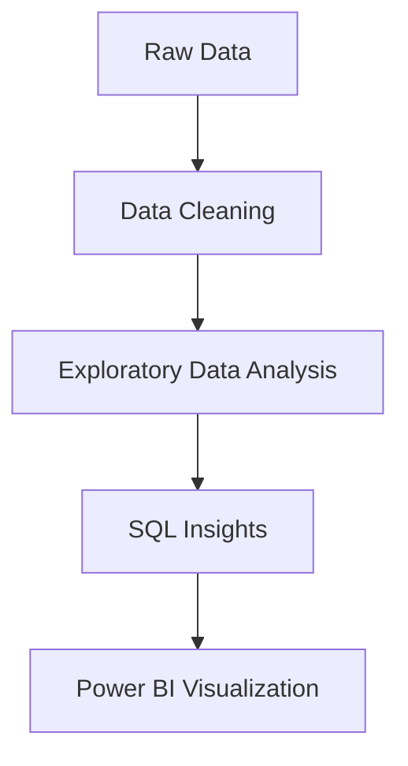

# Superstore Sales Analysis

## Project Overview
Analyze sales performance, customer behavior, and product trends for a US-based superstore using Python, SQL, and Power BI. This project demonstrates a full analytics workflow from raw data to business insights and interactive dashboards.

---

## Project Structure
```
Superstore-Sales-Analysis-Using-Power-BI-and-SQL/
│
├── data/
│   ├── superstore_sales_cleaned.csv         # Cleaned dataset
│   └── superstore_final_dataset.csv         # Final dataset for analysis
│
├── notebooks/
│   └── SuperstoreSalesAnalysis_JupyterNotebook.ipynb  # EDA, cleaning, and visualization
│
├── sql/
│   └── Superstore_sales_analysis_SQL_Insights.sql      # SQL queries for business insights
│
├── reports/
│   └── Superstore Sales Insights.pdf        # Power BI dashboard (PDF export)
│
├── DATA_DICTIONARY.md                      # Full data dictionary
├── requirements.txt                        # Python dependencies
├── .gitignore
└── README.md
```

---

## Quickstart
1. **Install requirements:**
   ```bash
   pip install -r requirements.txt
   ```
2. **Run the Jupyter Notebook:**
   ```bash
   jupyter notebook notebooks/SuperstoreSalesAnalysis_JupyterNotebook.ipynb
   ```
3. **Explore SQL Insights:**
   - Import `superstore_sales_cleaned.csv` or `superstore_final_dataset.csv` into your SQL database (e.g., MySQL, PostgreSQL) as a table named `superstore`.
   - Run the queries in `sql/Superstore_sales_analysis_SQL_Insights.sql`.
4. **View Power BI Dashboard:**
   - Open `reports/Superstore Sales Insights.pdf` for a static view.
   - (If available) Open the `.pbix` file in Power BI Desktop for interactivity.

---

## Data Dictionary
See [`DATA_DICTIONARY.md`](./DATA_DICTIONARY.md) for a complete description of all columns.

---

## How to Use Each Component
- **Jupyter Notebook:**
  - Perform exploratory data analysis, data cleaning, and generate visualizations.
  - Modify or extend the notebook for custom analysis.
- **SQL Scripts:**
  - Designed for use with any SQL-compliant database.
  - Import the cleaned dataset and run queries for business insights (e.g., top customers, shipping trends).
- **Power BI Report:**
  - Visualizes key metrics and trends interactively.
  - Use Power BI Desktop for full interactivity, or view the PDF for a summary.

---

## Example Analyses
- **Top 3 Customers by Sales:**
  - _Query:_ See `sql/Superstore_sales_analysis_SQL_Insights.sql`
  - _Sample Result:_ John Doe, Jane Smith, Alice Brown
- **Shipping Trends:**
  - What percentage of orders are shipped same-day?
  - _Query:_ See SQL file, Q1.

---

## Visual Workflow


---

## FAQ
- **How do I add new data?**
  - Add your CSV to `/data` and update the notebook path.
- **How do I run the SQL queries?**
  - Import the cleaned CSV into your SQL database as `superstore` and run the queries in `/sql`.
- **How do I view the Power BI dashboard?**
  - Open the PDF in `/reports` or use Power BI Desktop for the `.pbix` file (if available).

---

## Contributing
Contributions, issues, and feature requests are welcome! Feel free to fork the repo and submit a pull request.

---

## How to Take This Project to the Next Level
- Add predictive analytics (e.g., sales forecasting with machine learning)
- Automate data cleaning and reporting with scripts or workflows
- Build an interactive web dashboard (e.g., Streamlit, Dash)
- Integrate with a real database and provide ETL scripts
- Enhance Power BI with drill-through and what-if analysis
- Add unit tests and CI/CD for data scripts
- Expand documentation and add usage examples
- Containerize with Docker for easy setup

---

## Authors & Credits
- Original Author: Jannu Hans ([LinkedIn](#))
- Improvements & Fork: Akhilesh Pratap Singh ([LinkedIn](https://www.linkedin.com/in/akhilesh-pratap-singh-3b9048296/))

## License
MIT
